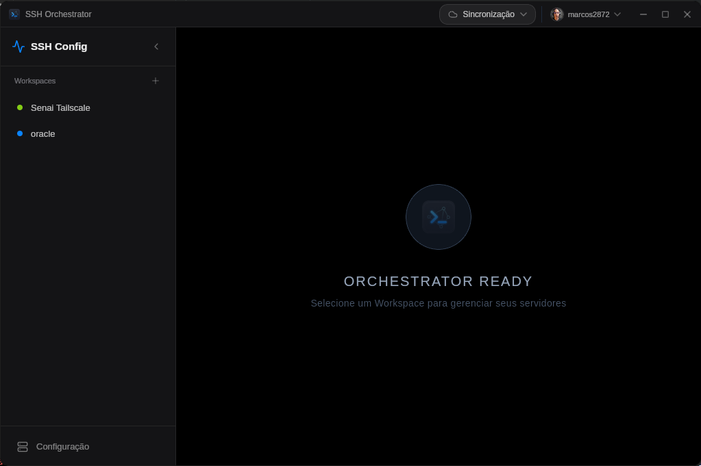
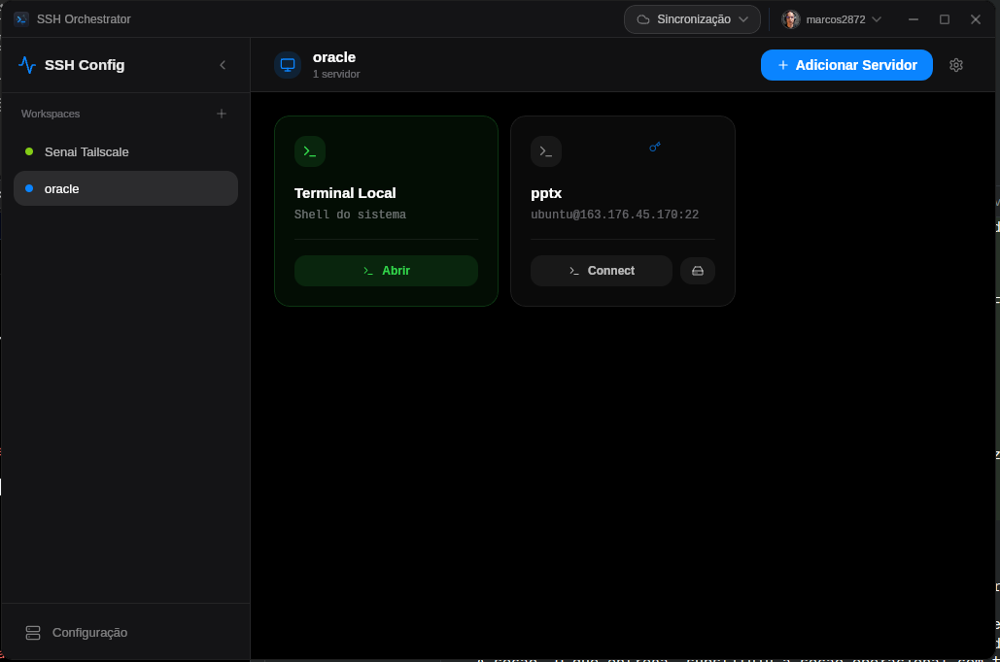
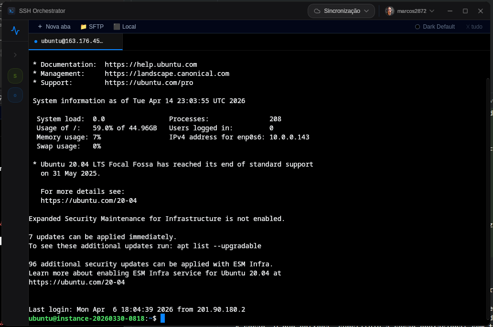
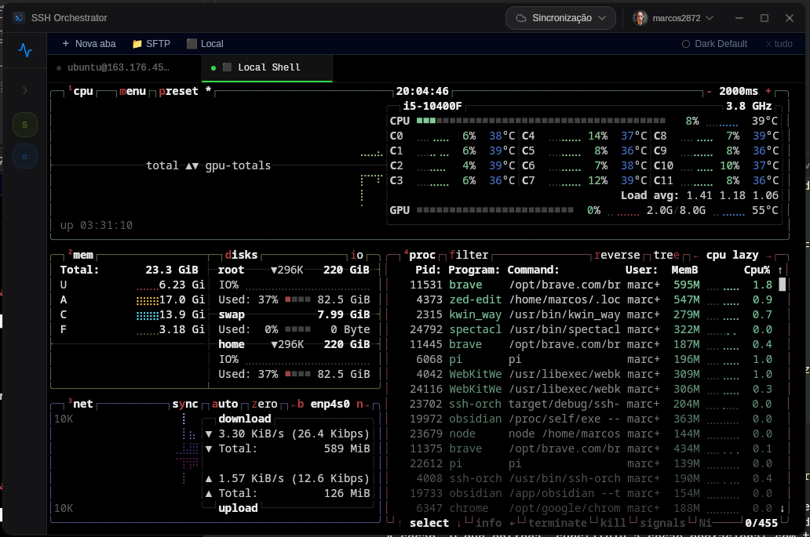
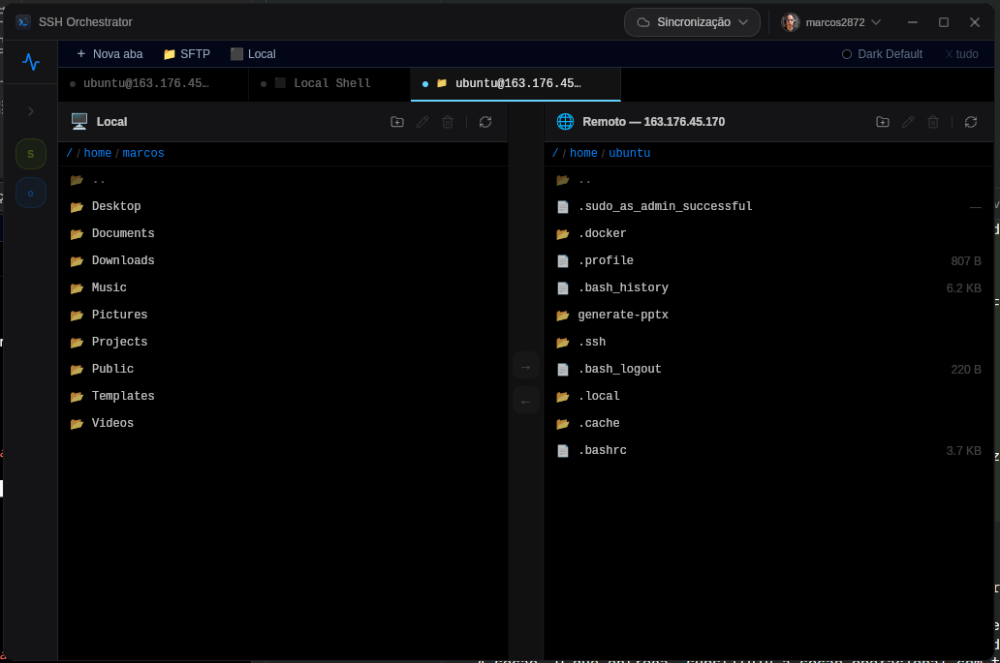

# SSH Orchestrator

[](https://github.com/marcos2872/SSH_Orchestrator/releases/latest)
[](https://tauri.app/)
[](https://www.rust-lang.org/)
[](https://react.dev/)
[](./LICENSE)

Cliente SSH/SFTP cross-platform com sincronização de workspaces via GitHub e vault criptografado. Construído com Tauri v2 + React 19 + Rust.

---

## Screenshots

| Vault | Workspaces |
|:---:|:---:|
|  |  |

| Servidores | Terminal SSH |
|:---:|:---:|
|  |  |

| Split Pane + Terminal Local | SFTP Dual-Pane |
|:---:|:---:|
|  |  |

---

## Funcionalidades

- **Terminal SSH** com tabs, split-pane horizontal/vertical e 6 temas (xterm.js)
- **SFTP Dual-Pane** — gerenciador de arquivos local ↔ remoto com transferências recursivas
- **Terminal Local** — shell nativo em aba dedicada via `portable-pty`
- **Vault Zero-Knowledge** — credenciais protegidas com AES-256-GCM + PBKDF2 (100k iterações); master password nunca armazenada
- **Sync via GitHub** — workspaces e servidores sincronizados entre dispositivos via repositório privado
- **CRDT sem conflitos** — merge determinístico com LWW-Register + Hybrid Logical Clock
- **Autenticação SSH flexível** — senha ou chave privada PEM com passphrase opcional
- **Teclas de atalho configuráveis** — personalize e salve combinações de teclas por dispositivo

---

## Stack

| Camada | Tecnologia |
|:---|:---|
| Frontend | React 19, TailwindCSS 3, xterm.js, lucide-react |
| Backend | Rust 1.77+, Tauri v2, Tokio |
| SSH / SFTP | russh v0.57 |
| Terminal Local | portable-pty v0.8 |
| Banco de dados | SQLite via sqlx 0.7 |
| Criptografia | ring — AES-256-GCM + PBKDF2-HMAC-SHA256 |
| Sync | git2 + CRDT (LWW-Register + HLC) |

---

## Instalação

Baixe o instalador para sua plataforma na [página de releases](https://github.com/marcos2872/SSH_Orchestrator/releases/latest):

- **Linux** → `.deb` (Debian/Ubuntu) ou `.rpm` (Fedora/RHEL)
- **Windows** → `.exe` (NSIS installer) *(em breve)*
- **macOS** → `.dmg` *(em breve)*

---

## Desenvolvimento

**Pré-requisitos:** Rust 1.77+, Node.js, pnpm

```bash
git clone https://github.com/marcos2872/SSH_Orchestrator.git
cd SSH_Orchestrator
pnpm install
cp .env.example .env   # configure GH_CLIENT_ID e GH_CLIENT_SECRET
pnpm tauri dev
```

> Para criar um GitHub OAuth App: *Settings → Developer Settings → OAuth Apps → New OAuth App*. URL de callback: `http://localhost`.

**Build de produção:**
```bash
pnpm tauri build
```

---

## Documentação

Documentação técnica completa disponível em [`docs/`](./docs/):

| Documento | Conteúdo |
|:---|:---|
| [Visão Geral](./docs/README.md) | Funcionalidades, fluxos e segurança |
| [Arquitetura](./docs/architecture.md) | Diagramas C4, fluxos de sequência |
| [API IPC](./docs/api.md) | Referência dos 47 comandos Tauri |
| [Modelos de Dados](./docs/models.md) | Schema SQLite, structs Rust, tipos CRDT |
| [Componentes](./docs/components.md) | Árvore React, props, dependências |
| [Estado & Hooks](./docs/state.md) | Estado global, hooks, keybindings |
| [ADRs](./docs/adr/) | Decisões arquiteturais |

---

## Licença

MIT — veja [LICENSE](./LICENSE).
