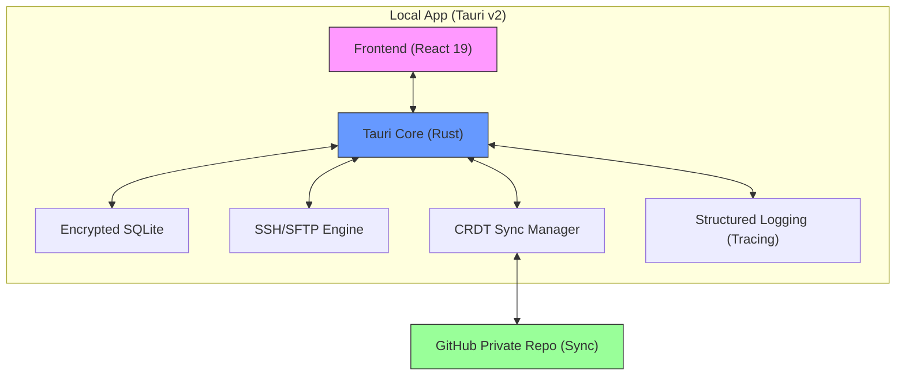

# 🚀 SSH Config Sync

[](https://opensource.org/licenses/MIT)
[](https://tauri.app/)
[](https://www.rust-lang.org/)
[](https://react.dev/)

**SSH Config Sync** is a professional, cross-platform SSH client designed for developers who need their configurations always synchronized. Built on **Tauri v2**, it offers a secure, high-performance experience with selective workspace syncing via private GitHub repositories.

---

## ✨ Key Features

- 🔐 **Integrated SSH + SFTP**: Unified terminal and file transfer experience.
- 📁 **Selective Workspace Sync**: Granular synchronization settings (Local-only vs. Cloud Sync).
- ☁️ **Conflict Resolution (CRDTs)**: Advanced sync engine using **Conflict-free Replicated Data Types** (LWW-Register) to ensure data consistency across multiple devices.
- 🔒 **Zero-Trust Security**: AES-256-GCM encryption for all sensitive data. Master password never leaves your machine.
- 🖥️ **Professional Terminal**: High-performance terminal emulator with **Tabs** and **Split-Pane** support for multitasking.
- ⚡ **Native Performance**: Minimal footprint (~20MB) and native speed powered by Rust.
- 🎨 **Modern Interface**: Clean UI built with React 19 and TailwindCSS, including sub-millisecond responsive micro-animations.

---

## 🛠️ Technology Stack

| Component | Technology |
| :--- | :--- |
| **Frontend** | React 19, TailwindCSS, Heroicons |
| **Backend** | Rust, Tauri v2, Tokio |
| **SSH/SFTP** | `russh` v0.45 |
| **Database** | SQLite (`sqlx`) with local encryption |
| **Crypto** | `ring` (AES-256-GCM + PBKDF2) |
| **Sync Engine** | Git-based storage + **CRDT** resolution logic |
| **Observability** | `tracing` (Structured Logging) |

---

## 📊 Architecture



---

## 🚀 Development Roadmap

### ✅ Phase 0.1 - Local MVP (Tauri v2)
- [x] Tauri v2 + React 19 basic setup
- [x] Local SQLite storage with initial encryption
- [x] Basic connection management
- [x] Simple Terminal emulator

### 🔐 Phase 0.2 - Security & Logging
- [x] `ring` AES-256 integration
- [x] **Structured Logging**: Implementation of `tracing-subscriber` for backend observability
- [x] Master Password Vault implementation

### ☁️ Phase 0.3 - Smart Sync
- [ ] GitHub OAuth + Private Repo provisioning
- [ ] **CRDT Engine**: Implementation of conflict-free synchronization logic
- [ ] Workspace push/pull with automatic merging

### ⚡ Phase 0.4 - Pro Terminal & SFTP
- [ ] **Terminal Tabs & Split-Pane** support
- [ ] Integrated SFTP operations (Drag & Drop)
- [ ] Native Themes & Keyboard Shortcuts

### 🔑 Phase 1.0 - SSH Identity Management
- [ ] SSH Key generation and management
- [ ] Native `ssh-agent` integration

---

## ⚙️ Development Setup

### Prerequisites

**1. Rust & Cargo (1.77+)**
```bash
curl --proto '=https' --tlsv1.2 -sSf https://sh.rustup.rs | sh
```

**2. Node.js & pnpm**
```bash
curl -fsSL https://get.pnpm.io/install.sh | sh -
```

### Installation & Run

1.  **Install dependencies:**
    ```bash
    pnpm install
    ```

2.  **Run in development:**
    ```bash
    pnpm tauri dev
    ```

---

## 🔒 Security & Reliability

1.  **Zero-Knowledge Architecture**: Your master password is never stored or transmitted.
2.  **State Consistency**: The CRDT-based sync ensures that even if you edit configurations offline or on concurrent devices, your changes are merged deterministically.
3.  **Observability**: Uses `tracing` to provide production-grade logs, ensuring all sync and connection operations are auditable.

---

## 📄 License

Distributed under the MIT License. See `LICENSE` for more information.

---

<div align="center">
  <strong>SSH Config Sync</strong> - Professional environment, synced everywhere 🚀
</div>
