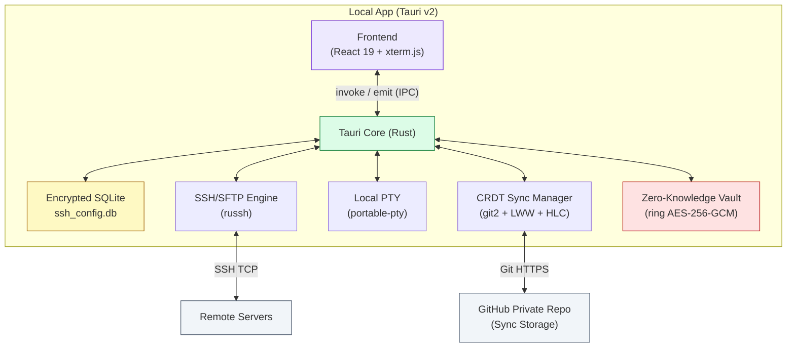

# 🚀 SSH Orchestrator

[](https://opensource.org/licenses/MIT)
[](https://tauri.app/)
[](https://www.rust-lang.org/)
[](https://react.dev/)
[](./src-tauri/Cargo.toml)

**SSH Orchestrator** is a professional, cross-platform SSH client designed for developers who need their configurations always synchronized. Built on **Tauri v2**, it offers a secure, high-performance experience with selective workspace syncing via private GitHub repositories.

---

## ✨ Key Features

- 🔐 **SSH + SFTP in One Place**: Full terminal emulator (xterm.js) with tabs, split-pane, and 6 built-in themes — plus a dual-pane SFTP file manager with drag & drop.
- 🖥️ **Local PTY Terminal**: Open a native shell tab without any SSH connection, powered by `portable-pty`.
- 🔑 **Flexible Authentication**: Connect using password or SSH private key (PEM) with optional passphrase — credentials stored with AES-256-GCM encryption.
- 📁 **Selective Workspace Sync**: Granular synchronization per workspace (Local-only vs. Cloud Sync via GitHub).
- ☁️ **Conflict-Free Sync (CRDTs)**: Advanced sync engine using **LWW-Register** with **Hybrid Logical Clocks** — deterministic merging even when editing offline across multiple devices.
- 🔒 **Zero-Knowledge Vault**: AES-256-GCM + PBKDF2 (100k iterations). Master password never stored — not even as a hash.
- ⚡ **Native Performance**: ~20 MB bundle, minimal RAM footprint, powered by Rust + Tokio.
- 🎨 **Modern UI**: React 19 + TailwindCSS with smooth micro-animations and a polished lock screen.

---

## 🛠️ Technology Stack

| Component | Technology |
| :--- | :--- |
| **Frontend** | React 19, TailwindCSS 3, lucide-react, xterm.js |
| **Backend** | Rust 1.77+, Tauri v2, Tokio |
| **SSH / SFTP** | `russh` v0.57 |
| **Local PTY** | `portable-pty` v0.8 |
| **Database** | SQLite via `sqlx` 0.7 |
| **Crypto** | `ring` — AES-256-GCM + PBKDF2-HMAC-SHA256 |
| **Sync Engine** | `git2` + CRDT (LWW-Register with HLC) |
| **Observability** | `tracing` — structured logging |

---

## 📊 Architecture



---

## 🔒 Security Architecture

```
Master Password  ──► PBKDF2-HMAC-SHA256 (100,000 iterations + 16-byte salt)
                          │
                          ▼
                   KEK (Key Encryption Key — never persisted)
                          │ AES-256-GCM encrypts
                          ▼
                   DEK (Data Encryption Key — stored in vault.json)
                          │ AES-256-GCM encrypts (random nonce per value)
                          ▼
             SSH passwords, private keys, passphrases → SQLite
```

**Key guarantees:**
- Master password is never stored — not in plaintext, not as a hash
- Each credential gets a unique random nonce → identical values produce different ciphertexts
- AES-256-GCM authentication tag detects any tampering
- GitHub repository contains only ciphertext — useless without the master password
- The frontend never receives raw credentials, only `has_saved_password: bool`

---

## 🚀 Development Roadmap

### ✅ Phase 0.1 — Local MVP
- [x] Tauri v2 + React 19 setup
- [x] Local SQLite storage with encryption
- [x] Basic connection management
- [x] Simple terminal emulator

### ✅ Phase 0.2 — Security & Logging
- [x] `ring` AES-256-GCM vault integration
- [x] Master Password zero-knowledge vault
- [x] Structured logging via `tracing-subscriber`

### ✅ Phase 0.3 — Smart Sync
- [x] GitHub OAuth 2.0 + private repo provisioning
- [x] CRDT engine (LWW-Register + Hybrid Logical Clock)
- [x] Workspace push/pull with automatic conflict resolution

### ✅ Phase 0.4 — Pro Terminal & SFTP
- [x] Terminal tabs & split-pane (horizontal/vertical)
- [x] Local PTY terminal (native shell, no SSH)
- [x] Dual-pane SFTP file manager with recursive transfers
- [x] 6 built-in terminal themes + keyboard shortcuts
- [x] SSH key authentication (PEM + passphrase)

### 🔑 Phase 1.0 — SSH Identity Management
- [ ] SSH key generation and management UI
- [ ] Native `ssh-agent` integration

---

## ⚙️ Development Setup

### Prerequisites

**1. Rust & Cargo (1.77+)**
```bash
curl --proto '=https' --tlsv1.2 -sSf https://sh.rustup.rs | sh
```

**2. Node.js & pnpm**
```bash
curl -fsSL https://get.pnpm.io/install.sh | sh -
```

**3. System dependencies (Linux)**

<details>
<summary>Ubuntu / Debian</summary>

```bash
sudo apt update && sudo apt install \
  libwebkit2gtk-4.1-dev build-essential curl wget file \
  libxdo-dev libssl-dev libayatana-appindicator3-dev librsvg2-dev
```
</details>

<details>
<summary>Arch Linux</summary>

```bash
sudo pacman -Syu
sudo pacman -S --needed webkit2gtk-4.1 base-devel curl wget file \
  openssl appmenu-gtk-module gtk3 libappindicator-gtk3 librsvg libvips
```
</details>

<details>
<summary>Fedora</summary>

```bash
sudo dnf install webkit2gtk4.1-devel openssl-devel curl wget file \
  libappindicator-gtk3-devel librsvg2-devel
sudo dnf group install "C Development Tools and Libraries"
```
</details>

### Installation

**1. Clone and install dependencies:**
```bash
git clone https://github.com/your-org/ssh-orchestrator.git
cd ssh-orchestrator
pnpm install
```

**2. Configure environment variables:**
```bash
cp .env.example .env
# Edit .env and set your GitHub OAuth app credentials:
# GH_CLIENT_ID=your_client_id
# GH_CLIENT_SECRET=your_client_secret
```

> To create a GitHub OAuth App: Settings → Developer Settings → OAuth Apps → New OAuth App.
> Set callback URL to `http://localhost` (the app uses a dynamic port).

**3. Run in development:**
```bash
pnpm tauri dev
```

**4. Build for production:**
```bash
pnpm tauri build
```

---

## ⌨️ Keyboard Shortcuts

| Shortcut | Action |
| :--- | :--- |
| `Ctrl+W` | Close active tab |
| `Ctrl+Tab` | Next tab |
| `Ctrl+Shift+Tab` | Previous tab |
| `Ctrl+\` | Split horizontal |
| `Ctrl+Shift+\` | Split vertical |
| `Ctrl+B` | Toggle SFTP panel |

---

## 🧪 Running Tests

```bash
# Rust unit tests (CRDT engine + crypto vault)
cd src-tauri && cargo test

# Type checking (TypeScript)
pnpm build

# Lint (Rust)
cd src-tauri && cargo clippy
```

---

## 📚 Documentation

Full technical documentation is available in [`docs/`](./docs/):

| Document | Description |
| :--- | :--- |
| [Overview](./docs/README.md) | Features, security details, usage flows |
| [Architecture](./docs/architecture.md) | C4 diagrams, sequence flows, service inventory |
| [IPC API](./docs/api.md) | All 47 Tauri commands + events reference |
| [Data Models](./docs/models.md) | SQLite schema, Rust structs, CRDT types |
| [Components](./docs/components.md) | React component tree, props, dependencies |
| [State & Hooks](./docs/state.md) | Global state, custom hooks, keybindings |
| [ADRs](./docs/adr/) | Architecture decision records |

---

## 📄 License

Distributed under the MIT License. See `LICENSE` for more information.

---

<div align="center">
  <strong>SSH Orchestrator</strong> — Professional SSH environment, synced everywhere 🚀
</div>
