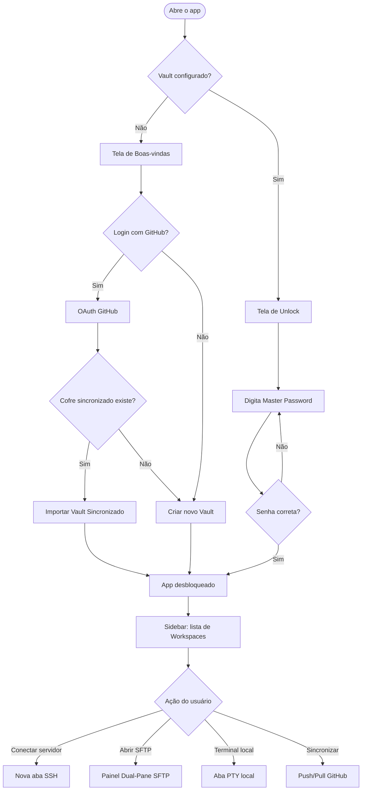

# SSH Orchestrator — Documentação Completa

> **Versão atual:** 0.0.3 · **Plataforma:** Cross-platform (Linux, macOS, Windows) · **Licença:** MIT

---

## O que é o SSH Orchestrator?

O **SSH Orchestrator** (internamente _SSH Config Sync_) é um cliente SSH/SFTP nativo de alto desempenho construído com **Tauri v2 + React 19 + Rust**. Ele resolve um problema específico de desenvolvedores que trabalham em múltiplos dispositivos: manter configurações e credenciais de servidores SSH sempre sincronizadas, seguras e disponíveis — sem comprometer a privacidade.

Toda I/O sensível acontece **no processo Rust** (backend nativo); o frontend React nunca acessa credenciais em texto claro, sistema de arquivos ou rede diretamente.

---

## Funcionalidades Principais

### 🔐 Terminal SSH Profissional

- Emulador de terminal completo baseado em **xterm.js** com suporte a cores 256/truecolor
- **Múltiplas abas** — cada aba é uma sessão SSH independente
- **Split-pane** — divisão horizontal ou vertical de terminal na mesma janela
- **Terminal local** — aba PTY local usando o shell nativo do sistema (sem SSH)
- **Temas de terminal** — 6 temas pré-definidos: Dark Default, Dracula, Nord, Solarized Dark, One Dark, High Contrast
- Redimensionamento dinâmico de PTY (cols × rows) sincronizado com o backend
- Autenticação por **senha** ou **chave SSH privada (PEM)** com suporte a passphrase

### 📁 Gerenciador de Arquivos SFTP Dual-Pane

- Painel duplo: **sistema local** (esquerda) ↔ **servidor remoto** (direita)
- Operações completas: listar, fazer upload, download, excluir, renomear, criar diretório
- Upload/download **recursivo** de diretórios completos
- **Fila de transferência** com progresso em tempo real via eventos Tauri
- Conexão SFTP direta (sem sessão SSH ativa) para uso no gerenciador de arquivos dedicado
- Navegação pela home do servidor e diretório de trabalho atual

### 🗂️ Workspaces e Gerenciamento de Servidores

- Organização de servidores em **workspaces** com cor personalizada
- Cada workspace pode ser **local** (privado) ou **sincronizado via GitHub**
- Criação, edição e exclusão de servidores com campos: nome, host, porta, usuário, método de autenticação
- Suporte a credenciais múltiplas por servidor: senha, chave SSH + passphrase
- **Soft-delete** em todos os registros — deleções se propagam via sincronização CRDT
- Indicador visual de servidores com senha salva (`has_saved_password`) sem expor o valor

### ☁️ Sincronização com GitHub (CRDT)

- Autenticação via **GitHub OAuth 2.0** com fluxo PKCE (state anti-CSRF)
- Provisionamento automático de repositório privado de sincronização
- Motor de sincronização baseado em **CRDT LWW-Register com HLC (Hybrid Logical Clock)**
- Operações de `pull` e `push` com loop de tentativas para evitar force-push
- Merging determinístico: em conflito, o registro com HLC mais recente vence
- Tombstones para deleções — a exclusão se propaga entre dispositivos corretamente
- Workspaces marcados como `local_only` nunca são enviados ao repositório
- Exportação e importação do cofre criptografado (`vault_sync.json`) para portabilidade entre dispositivos

### 🔒 Vault de Segurança (Zero-Knowledge)

- Tela de **VaultGuard** bloqueia completamente o app antes da autenticação
- Três estados: `Unconfigured` → `setup` → `Locked` → `Unlocked`
- Derivação de chave com **PBKDF2-HMAC-SHA256** (100.000 iterações) + salt de 16 bytes
- Arquitetura de duas chaves: **KEK** (derivada da senha) cifra a **DEK** (chave de dados)
- Toda credencial armazenada no banco está cifrada com **AES-256-GCM**
- Master Password **nunca é armazenada** — nem em texto claro, nem em hash
- Avaliação de força de senha em tempo real no fluxo de setup
- Detecção de Caps Lock durante entrada de senha
- Importação de cofre sincronizado: re-cifra automaticamente o token GitHub com o novo DEK

### 🖥️ Terminal Local (PTY Nativo)

- Spawning de shell nativo via `portable-pty` (sem SSH)
- Suporte a redimensionamento de PTY
- Output entregue via eventos `pty://data/{session_id}`
- Evento `pty://close/{session_id}` ao encerrar o shell
- Input aceita dados binários codificados em base64

---

## Diferenciais Técnicos

### Arquitetura Zero-Trust

O frontend **nunca recebe credenciais** em texto claro. O campo `password_enc` do banco nunca é enviado ao React — apenas o booleano `has_saved_password`. Toda descriptografia acontece no processo Rust, cujo sandbox é gerenciado pelo Tauri v2.

### CRDT com HLC (Hybrid Logical Clock)

A resolução de conflitos de sincronização usa **LWW-Register** (Last-Writer-Wins) com timestamps **HLC**:

```
HLC = timestamp_ms:counter:node_id
```

O HLC garante ordenação total mesmo com clocks de sistema divergentes entre dispositivos. O `node_id` de 8 caracteres (UUID truncado) é gerado por dispositivo e persiste entre sessões.

### Performance Nativa (~20 MB)

Ao contrário de Electron, o Tauri v2 usa a WebView do sistema operacional. O backend Rust utiliza Tokio para I/O assíncrono e DashMap para estado compartilhado de alta concorrência (sessões SSH e SFTP).

### Observabilidade Estruturada

Todos os handlers IPC são instrumentados com `#[tracing::instrument]`. Logs estruturados via `tracing-subscriber` facilitam auditoria de operações de sincronização e conexão.

---

## Segurança em Detalhes

### Camadas de proteção de credenciais

```
Master Password (digitada pelo usuário)
        │
        ▼
PBKDF2-HMAC-SHA256 (100.000 iterações, salt 16 bytes)
        │
        ▼
KEK (Key Encryption Key, 256 bits — nunca persiste em disco)
        │ cifra com AES-256-GCM
        ▼
DEK (Data Encryption Key, 256 bits — armazenada cifrada em vault.json)
        │ cifra com AES-256-GCM
        ▼
Credenciais (senha, chave SSH, passphrase) → armazenadas em servers.password_enc
```

### Proteções contra ataques

| Ameaça | Contramedida |
|---|---|
| Leitura do banco de dados | AES-256-GCM com nonce aleatório por operação |
| Adulteração de dados | GCM Authentication Tag detecta modificações |
| Ataque de força bruta à master password | PBKDF2 com 100.000 iterações adiciona latência artificial |
| CSRF no fluxo OAuth | State nonce de 16 caracteres verificado antes do troca de token |
| Token GitHub exfiltrado | Armazenado cifrado (`github_token.enc`) com o vault DEK |
| Credenciais em logs | Handlers com `skip(password, ssh_key, ssh_key_passphrase)` no tracing |
| Hard-delete acidental | Todos os registros usam soft-delete (`deleted = 1`) |

### Sincronização e confidencialidade

As credenciais são enviadas ao repositório GitHub **já cifradas** com o DEK do vault. O repositório contém apenas ciphertext — sem a master password é impossível descriptografar. O `vault_sync.json` contém o DEK cifrado com a KEK; sem a master password, o DEK não pode ser extraído.

---

## Stack Tecnológica

| Camada | Tecnologia | Versão |
|---|---|---|
| Frontend | React | 19 |
| Estilo | TailwindCSS | 3 |
| Build | Vite | 7 |
| Runtime desktop | Tauri | v2 |
| Backend | Rust | 1.77+ |
| Async runtime | Tokio | — |
| SSH/SFTP | russh | 0.57 |
| Terminal | xterm.js | — |
| Banco de dados | SQLite via sqlx | 0.7 |
| Criptografia | ring (AES-256-GCM + PBKDF2) | — |
| CRDT | Implementação interna (HLC + LWW) | — |
| Sincronização | git2 + GitHub API | — |
| PTY local | portable-pty | — |
| Logging | tracing + tracing-subscriber | — |

---

## Fluxo de Uso Típico



---

## Atalhos de Teclado

| Atalho | Ação |
|---|---|
| `Ctrl+W` | Fechar aba ativa |
| `Ctrl+Tab` | Próxima aba |
| `Ctrl+Shift+Tab` | Aba anterior |
| `Ctrl+\` | Split horizontal |
| `Ctrl+Shift+\` | Split vertical |
| `Ctrl+B` | Toggle painel SFTP |

---

## Estrutura de Diretórios

```
SSH_Orchestrator/
├── src/                          # Frontend React
│   ├── components/
│   │   ├── Terminal/             # Emulador SSH + PTY local + tabs + split
│   │   ├── Sftp/                 # Gerenciador de arquivos dual-pane
│   │   ├── Servers/              # Modal de criação/edição de servidores
│   │   ├── Workspaces/           # Tela de detalhes de workspace
│   │   ├── sync/                 # Indicador de progresso de sync
│   │   ├── Sidebar.tsx           # Navegação lateral
│   │   ├── TitleBar.tsx          # Barra de título customizada
│   │   └── VaultGuard.tsx        # Guarda de autenticação do vault
│   ├── hooks/                    # useTerminalManager, useTerminalTheme, useToast, useAuth
│   └── lib/
│       ├── api/                  # Wrappers invoke() por domínio
│       ├── keybindings.ts        # Mapa de atalhos
│       └── themes.ts             # Temas do terminal
│
├── src-tauri/src/                # Backend Rust
│   ├── handlers/                 # Entry points IPC por domínio
│   ├── services/                 # Lógica: crypto, db, ssh, sftp, pty
│   ├── models/                   # Structs compartilhadas
│   ├── sync/                     # Motor CRDT: crdt, git_ops, merge, repo
│   └── auth/                     # GitHub OAuth
│
└── docs/                         # Esta documentação
```

---

## Documentação Relacionada

- [Arquitetura e decisões técnicas](./architecture.md)
- [Comandos IPC (API)](./api.md)
- [Modelos de dados](./models.md)
- [Componentes React](./components.md)
- [Estado global e hooks](./state.md)
