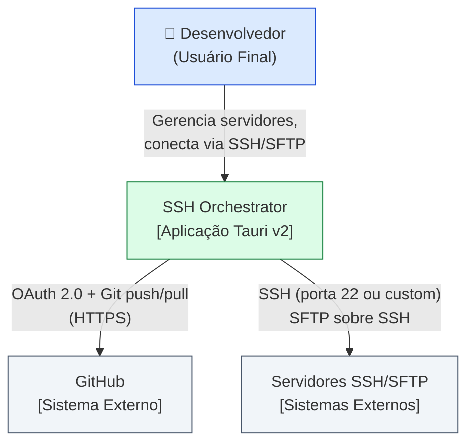
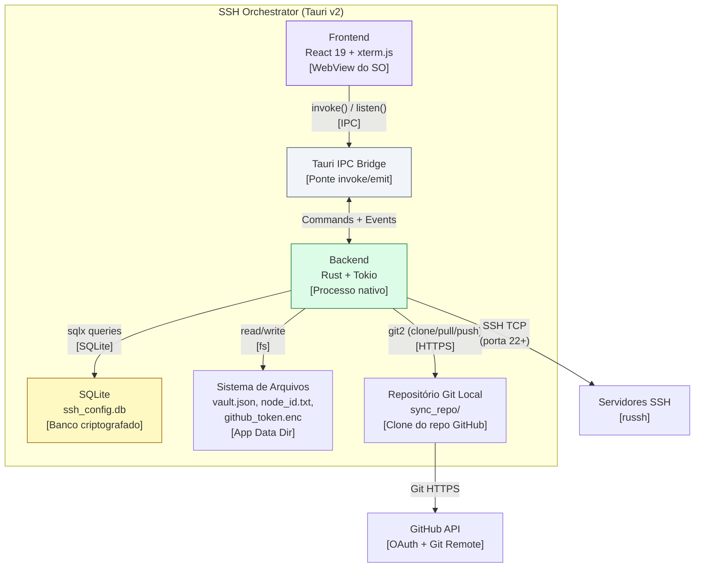
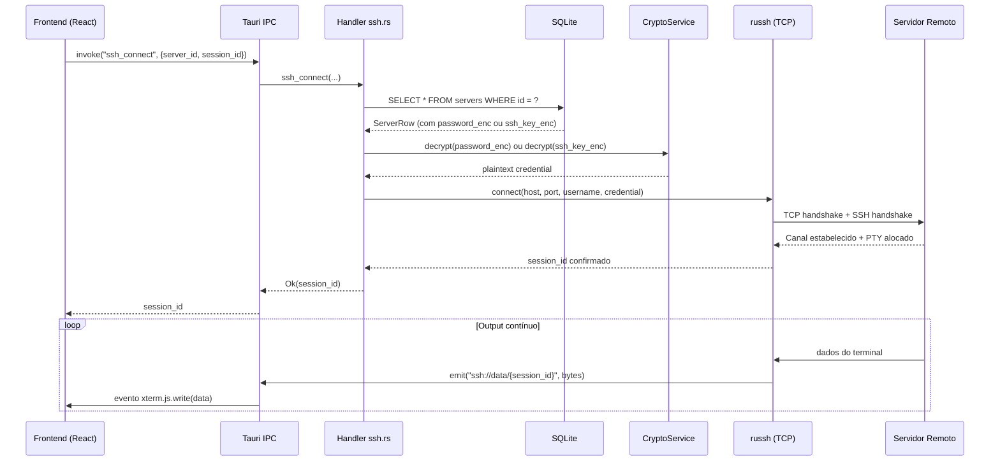
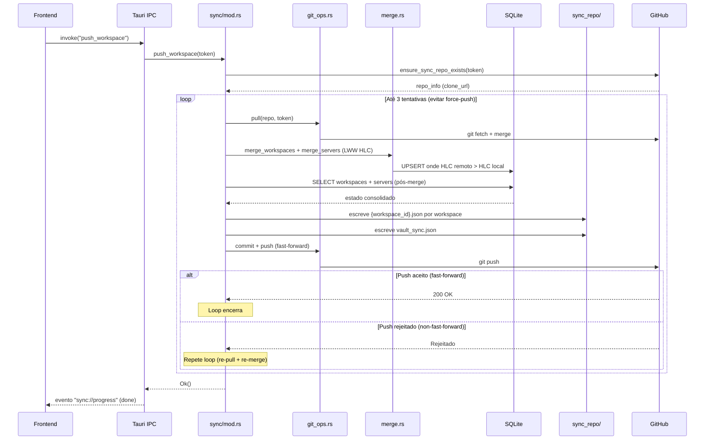
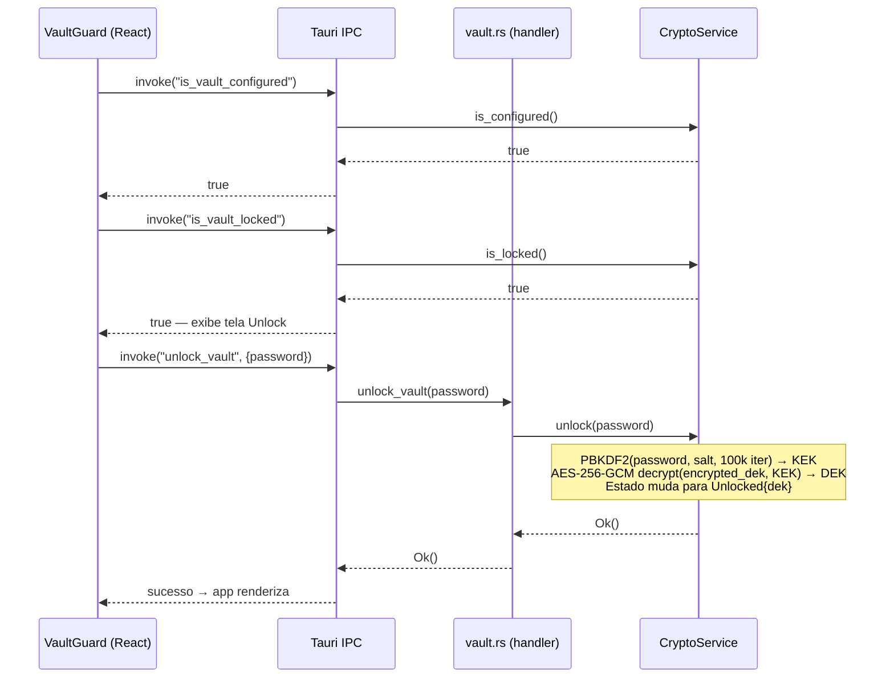

# Arquitetura do Sistema

> Última atualização: 2026-04-14

---

## Visão Geral (C4 — Nível 1: Contexto)



---

## Containers (C4 — Nível 2)



---

## Fluxo de Dados — Conexão SSH



---

## Fluxo de Dados — Sincronização (Push)



---

## Fluxo de Dados — Vault (Unlock)



---

## Inventário de Serviços

| Serviço / Módulo | Responsabilidade | Tecnologia | Localização |
|---|---|---|---|
| Frontend | Interface do usuário, terminal xterm.js, SFTP UI | React 19 + Vite + TailwindCSS | `src/` |
| Tauri IPC Bridge | Ponte invoke/emit entre frontend e backend | Tauri v2 | runtime |
| DbService | Persistência de workspaces e servidores | SQLite + sqlx 0.7 | `services/db.rs` |
| CryptoService | Vault zero-knowledge, encrypt/decrypt AES-256-GCM | ring (Rust) | `services/crypto.rs` |
| SshService | Conexão SSH, PTY remoto, redimensionamento | russh 0.57 + DashMap | `services/ssh.rs` |
| SftpService | Operações de arquivo remoto e local, transferências | russh SFTP + DashMap | `services/sftp.rs` |
| PtyService | Shell local nativo, PTY multiplexado | portable-pty + DashMap | `services/pty.rs` |
| SyncModule | Orquestração push/pull, serialização, lock | Tokio Mutex + git2 | `sync/mod.rs` |
| CRDTEngine | HLC, LWW-Register, merge determinístico | Rust puro | `sync/crdt.rs` |
| GitOps | Clone, pull, commit, push (FF + force fallback) | git2 | `sync/git_ops.rs` |
| MergeModule | Merge LWW entre SQLite local e JSON remoto | sqlx + crdt | `sync/merge.rs` |
| RepoModule | Provisionamento do repo GitHub via API REST | reqwest | `sync/repo.rs` |
| AuthModule | GitHub OAuth 2.0, troca de código, perfil | reqwest + Tokio TCP | `auth/github.rs` |

---

## Decisões Arquiteturais (ADRs)

- [0001 — Tauri v2 como framework desktop](./adr/0001-tauri-v2-framework-desktop.md)
- [0002 — AES-256-GCM com PBKDF2 para vault zero-knowledge](./adr/0002-aes256gcm-pbkdf2-vault.md)
- [0003 — CRDT LWW-Register com HLC para resolução de conflitos](./adr/0003-crdt-lww-hlc-sync.md)
- [0004 — GitHub como backend de sincronização](./adr/0004-github-sync-backend.md)

---

## AppState — Estado Compartilhado do Backend

```rust
pub struct AppState {
    pub db: DbService,          // Pool SQLite (sqlx)
    pub ssh: SshService,        // DashMap<session_id, SshSession>
    pub sftp: SftpService,      // DashMap<session_id, SftpSession>
    pub pty: PtyService,        // DashMap<session_id, PtySession>
    pub crypto: CryptoService,  // RwLock<VaultState>
    pub sync_lock: Mutex<()>,   // Impede sincronizações concorrentes
    pub node_id: String,        // Identificador único do dispositivo (8 chars)
}
```

O `AppState` é injetado em todos os handlers via `tauri::State<'_, AppState>`, garantindo um único ponto de acesso a todos os serviços sem passagem explícita de dependências.
