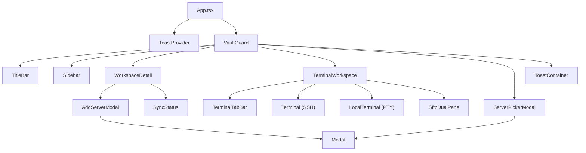

# Componentes React

> Todos os componentes usam `interface Props {}` local, importam tipos com `import type`
> e nunca fazem `fetch` diretamente — toda I/O passa pelos wrappers em `src/lib/api/`.

---

## Árvore de Componentes

---

## Componente: `VaultGuard`

**Arquivo:** `src/components/VaultGuard.tsx`
**Descrição:** Guarda de autenticação que bloqueia toda a aplicação até que o vault seja desbloqueado. Gerencia o fluxo completo de setup, unlock e importação de cofre sincronizado.

### Estados internos (`VaultFlowState`)

| Estado | Descrição |
|---|---|
| `loading` | Verificando estado do vault com o backend |
| `welcome` | Primeira vez — opções: login GitHub ou uso local |
| `setup` | Criação da Master Password (com avaliação de força) |
| `unlock` | Tela de desbloqueio para vault já configurado |
| `unlock_synced` | Importação de vault sincronizado encontrado no repo |

### Funcionalidades de UX

- Avaliação de força de senha em tempo real (weak / fair / good / strong)
- Detecção de Caps Lock ativo
- Animação de shake no campo de senha em caso de erro
- Exibição de "última sessão: há X min" na tela de unlock
- Animação de transição entre estados (fade + translate)
- Controles de janela (minimizar/fechar) visíveis antes do unlock

### Dependências

| Dependência | Tipo | Motivo |
|---|---|---|
| `src/lib/api/vault.ts` | API | Todas as operações do vault |
| `useAuth` | Hook | Login GitHub na tela de boas-vindas |
| `useToast` | Hook | Feedback de sucesso/erro |

---

## Componente: `Sidebar`

**Arquivo:** `src/components/Sidebar.tsx`
**Descrição:** Barra lateral com lista de workspaces, navegação global e botão de criação de novo workspace.

### Props

| Prop | Tipo | Obrigatório | Descrição |
|---|---|---|---|
| `onSelectWorkspace` | `(ws: Workspace \| null) => void` | Sim | Callback ao selecionar workspace |
| `selectedId` | `string \| undefined` | Não | ID do workspace ativo |
| `hasTabs` | `boolean` | Sim | Controla visibilidade do sidebar quando há abas abertas |

### Dependências

| Dependência | Tipo | Motivo |
|---|---|---|
| `src/lib/api/workspaces.ts` | API | Listar e criar workspaces |
| `src/lib/api/auth.ts` | API | Exibir avatar do usuário autenticado |
| `useToast` | Hook | Erros de carregamento |

---

## Componente: `WorkspaceDetail`

**Arquivo:** `src/components/Workspaces/WorkspaceDetail.tsx`
**Descrição:** Tela principal de um workspace — lista servidores, permite conectar via SSH/SFTP, editar workspace e disparar sincronização.

### Props

| Prop | Tipo | Obrigatório | Descrição |
|---|---|---|---|
| `workspace` | `Workspace` | Sim | Workspace sendo exibido |
| `onConnect` | `(server: Server) => void` | Sim | Abre aba SSH |
| `onSftp` | `(server: Server) => void` | Sim | Abre aba SFTP |
| `onOpenLocal` | `() => void` | Sim | Abre terminal local |
| `onWorkspaceUpdated` | `(ws: Workspace) => void` | Sim | Atualiza workspace na sidebar |
| `onWorkspaceDeleted` | `() => void` | Sim | Limpa seleção após delete |

### Dependências

| Dependência | Tipo | Motivo |
|---|---|---|
| `src/lib/api/servers.ts` | API | CRUD de servidores |
| `src/lib/api/workspaces.ts` | API | Atualizar/deletar workspace |
| `src/lib/api/workspaces.ts` | API | push_workspace / pull_workspace |
| `AddServerModal` | Componente | Formulário de criação/edição |
| `SyncStatus` | Componente | Progresso de sincronização |
| `useToast` | Hook | Feedback de operações |

---

## Componente: `AddServerModal`

**Arquivo:** `src/components/Servers/AddServerModal.tsx`
**Descrição:** Modal de criação e edição de servidor SSH. Gerencia campos de credencial com opção de salvar cifrado, seleção de método de autenticação e validação.

### Props

| Prop | Tipo | Obrigatório | Descrição |
|---|---|---|---|
| `isOpen` | `boolean` | Sim | Controla visibilidade |
| `workspaceId` | `string` | Sim | Workspace dono do servidor |
| `server` | `Server \| null` | Não | Se não null, modo edição |
| `onClose` | `() => void` | Sim | Fecha o modal |
| `onSaved` | `(server: Server) => void` | Sim | Callback após salvar |

### Campos do formulário

| Campo | Tipo | Descrição |
|---|---|---|
| Nome | text | Identificador de exibição |
| Host | text | Hostname ou IP |
| Porta | number | Default: 22 |
| Usuário | text | Username SSH |
| Método de auth | radio | `password` ou `ssh_key` |
| Senha | password | Cifrada se `save_password = true` |
| Chave SSH (PEM) | textarea | Cifrada se `save_ssh_key = true` |
| Passphrase | password | Cifrada se `save_ssh_key_passphrase = true` |

---

## Componente: `TerminalWorkspace`

**Arquivo:** `src/components/Terminal/TerminalWorkspace.tsx`
**Descrição:** Orquestrador do workspace de terminal — gerencia layout de abas, split-pane e renderização condicional de `Terminal`, `LocalTerminal` e `SftpDualPane`.

### Props

| Prop | Tipo | Obrigatório | Descrição |
|---|---|---|---|
| `tabs` | `Tab[]` | Sim | Lista de abas abertas |
| `activeTabId` | `string \| null` | Sim | ID da aba ativa |
| `splitTab` | `Tab \| null` | Sim | Aba no painel split (ou null) |
| `splitMode` | `SplitMode` | Sim | `"none"`, `"horizontal"`, `"vertical"` |
| `themeId` | `string` | Sim | ID do tema ativo |
| `onSelectTab` | `(id: string) => void` | Sim | Seleciona aba |
| `onCloseTab` | `(id: string) => void` | Sim | Fecha aba |
| `onSessionId` | `(tabId, sessionId) => void` | Sim | Registra session_id SSH |

---

## Componente: `Terminal`

**Arquivo:** `src/components/Terminal/Terminal.tsx`
**Descrição:** Emulador de terminal SSH baseado em xterm.js. Gerencia o ciclo completo: `ssh_connect` → output via eventos Tauri → input via `ssh_write` → `ssh_disconnect`.

### Props

| Prop | Tipo | Obrigatório | Descrição |
|---|---|---|---|
| `tab` | `Tab` | Sim | Aba com dados do servidor |
| `themeId` | `string` | Sim | Tema visual do terminal |
| `isActive` | `boolean` | Sim | Controla foco |
| `onSessionId` | `(tabId, sessionId) => void` | Sim | Comunica session_id para split SFTP |

### Eventos Tauri escutados

| Evento | Ação |
|---|---|
| `ssh://data/{session_id}` | `xterm.write(data)` |

---

## Componente: `LocalTerminal`

**Arquivo:** `src/components/Terminal/LocalTerminal.tsx`
**Descrição:** Terminal local usando PTY nativo (`pty_spawn`). Funciona sem SSH — usa o shell padrão do sistema.

### Props

| Prop | Tipo | Obrigatório | Descrição |
|---|---|---|---|
| `tab` | `Tab` | Sim | Aba do tipo `"local"` |
| `themeId` | `string` | Sim | Tema visual |
| `isActive` | `boolean` | Sim | Controla foco |

### Eventos Tauri escutados

| Evento | Ação |
|---|---|
| `pty://data/{session_id}` | Decodifica base64 → `xterm.write` |
| `pty://close/{session_id}` | Exibe mensagem de encerramento |

---

## Componente: `TerminalTabBar`

**Arquivo:** `src/components/Terminal/TerminalTabBar.tsx`
**Descrição:** Barra de abas do workspace de terminal com indicadores de tipo (SSH / SFTP / Local).

### Props

| Prop | Tipo | Obrigatório | Descrição |
|---|---|---|---|
| `tabs` | `Tab[]` | Sim | Lista de abas |
| `activeTabId` | `string \| null` | Sim | Aba ativa |
| `splitTabId` | `string \| null` | Sim | Aba no painel split |
| `onSelect` | `(id: string) => void` | Sim | Seleciona aba |
| `onClose` | `(id: string) => void` | Sim | Fecha aba |

---

## Componente: `ServerPickerModal`

**Arquivo:** `src/components/Terminal/ServerPickerModal.tsx`
**Descrição:** Modal de seleção de servidor para abrir nova aba ou sessão SFTP. Filtra servidores do workspace ativo.

### Props

| Prop | Tipo | Obrigatório | Descrição |
|---|---|---|---|
| `isOpen` | `boolean` | Sim | Visibilidade |
| `workspaceId` | `string \| null` | Sim | Workspace a filtrar servidores |
| `onSelect` | `(server: ApiServer) => void` | Sim | Callback ao escolher servidor |
| `onClose` | `() => void` | Sim | Fecha modal |

---

## Componente: `SftpDualPane`

**Arquivo:** `src/components/Sftp/SftpDualPane.tsx`
**Descrição:** Gerenciador de arquivos dual-pane. Painel esquerdo: sistema local. Painel direito: servidor remoto via SFTP.

### Props

| Prop | Tipo | Obrigatório | Descrição |
|---|---|---|---|
| `tab` | `Tab` | Sim | Aba com dados do servidor |
| `isActive` | `boolean` | Sim | Controla foco |

### Dependências

| Dependência | Tipo | Motivo |
|---|---|---|
| `src/lib/api/sftp.ts` | API | Todas as operações SFTP e locais |
| `useSftpQueue` | Hook | Fila de transferências com progresso |
| `SftpPanel` | Componente | Renderização de cada painel |
| `TransferQueue` | Componente | Exibição da fila de transfers |

---

## Componente: `SyncStatus`

**Arquivo:** `src/components/sync/SyncStatus.tsx`
**Descrição:** Indicador de progresso da sincronização. Escuta `sync://progress` e exibe steps em tempo real.

### Props

| Prop | Tipo | Obrigatório | Descrição |
|---|---|---|---|
| `workspaceId` | `string` | Sim | ID do workspace sendo sincronizado |

### Eventos Tauri escutados

| Evento | Ação |
|---|---|
| `sync://progress` | Atualiza step e detail exibidos |

---

## Componente: `TitleBar`

**Arquivo:** `src/components/TitleBar.tsx`
**Descrição:** Barra de título customizada com drag-region, controles de janela nativos e ações globais (tema, usuário logado).

---

## Componente: `Modal`

**Arquivo:** `src/components/Modal.tsx`
**Descrição:** Wrapper genérico de modal com animação de entrada/saída, backdrop e fechamento por Esc ou clique fora.

### Props

| Prop | Tipo | Obrigatório | Descrição |
|---|---|---|---|
| `isOpen` | `boolean` | Sim | Visibilidade |
| `onClose` | `() => void` | Sim | Callback de fechamento |
| `title` | `string` | Não | Título opcional do modal |
| `children` | `ReactNode` | Sim | Conteúdo |

---

## Componente: `Toast` / `ToastContainer`

**Arquivo:** `src/components/Toast.tsx`
**Descrição:** Sistema de notificações toast (success / error / info). Renderiza fila de toasts com auto-dismiss.

> Consumido via hook `useToast()` — não usado diretamente em outros componentes.
