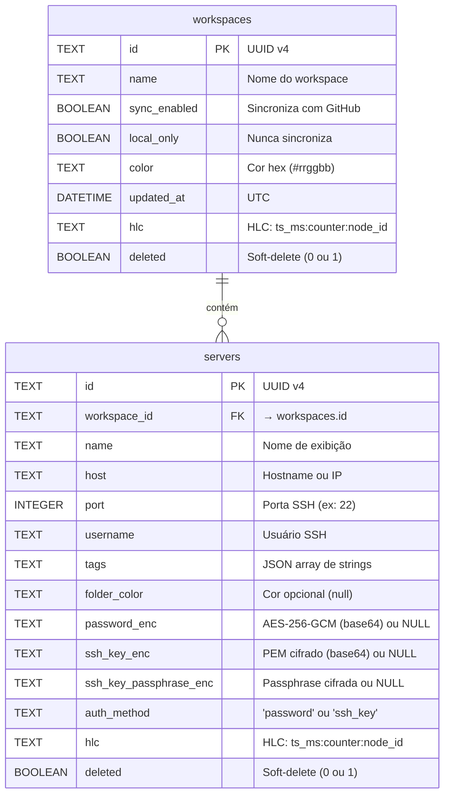

# Modelos de Dados

> Esta documentação descreve o esquema do banco SQLite e as structs Rust que
> o representam. Todo campo `*_enc` contém ciphertext AES-256-GCM codificado
> em base64 — nunca um valor em texto claro.

---

## Esquema do Banco de Dados (SQLite)



---

## Tabela: `workspaces`

| Coluna | Tipo | Obrigatório | Padrão | Descrição |
|---|---|---|---|---|
| `id` | TEXT (UUID) | Sim | gerado | Identificador único |
| `name` | TEXT | Sim | — | Nome exibido na sidebar |
| `sync_enabled` | BOOLEAN | Sim | `0` | Habilita sincronização com GitHub |
| `local_only` | BOOLEAN | Sim | `0` | Workspace nunca enviado ao repo |
| `color` | TEXT | Sim | — | Cor de identificação visual (hex) |
| `updated_at` | DATETIME | Sim | — | Timestamp da última atualização |
| `hlc` | TEXT | Sim | `''` | HLC para resolução CRDT |
| `deleted` | BOOLEAN | Sim | `0` | Soft-delete — nunca excluir fisicamente |

### Regras de negócio

- Workspaces com `sync_enabled = false` **ou** `local_only = true` nunca são incluídos no push para o GitHub
- Workspaces deletados (`deleted = 1`) são enviados como tombstone (sem servidores) para propagar a deleção entre dispositivos
- A listagem `get_workspaces` filtra `deleted = 0`

---

## Tabela: `servers`

| Coluna | Tipo | Obrigatório | Padrão | Descrição |
|---|---|---|---|---|
| `id` | TEXT (UUID) | Sim | gerado | Identificador único |
| `workspace_id` | TEXT (UUID) | Sim | — | FK para `workspaces.id` |
| `name` | TEXT | Sim | — | Nome de exibição no UI |
| `host` | TEXT | Sim | — | Hostname ou endereço IP |
| `port` | INTEGER | Sim | — | Porta SSH (geralmente 22) |
| `username` | TEXT | Sim | — | Usuário para autenticação SSH |
| `tags` | TEXT | Sim | `'[]'` | Array de strings serializado como JSON |
| `folder_color` | TEXT | Não | NULL | Cor opcional para agrupamento |
| `password_enc` | TEXT | Não | NULL | Senha SSH cifrada com AES-256-GCM (base64) |
| `ssh_key_enc` | TEXT | Não | NULL | Chave PEM cifrada (base64) |
| `ssh_key_passphrase_enc` | TEXT | Não | NULL | Passphrase da chave cifrada (base64) |
| `auth_method` | TEXT | Sim | `'password'` | Método preferido: `'password'` ou `'ssh_key'` |
| `hlc` | TEXT | Sim | `''` | HLC para resolução CRDT |
| `deleted` | BOOLEAN | Sim | `0` | Soft-delete |

### Regras de segurança

- O campo `password_enc` **nunca é enviado ao frontend** — apenas o booleano `has_saved_password`
- A deleção de `ssh_key_enc` limpa automaticamente `ssh_key_passphrase_enc` (um não faz sentido sem o outro)
- Ao atualizar com `save_password = true` mas sem novo valor, o valor existente é preservado

---

## Structs Rust

### `Workspace`

```rust
pub struct Workspace {
    pub id: Uuid,
    pub name: String,
    pub sync_enabled: bool,
    pub local_only: bool,
    pub color: String,
    pub updated_at: DateTime<Utc>,
    pub hlc: String,
    pub deleted: bool,
}
```

**Traits:** `Debug, Clone, Serialize, Deserialize, sqlx::FromRow`

---

### `Server` (enviado ao frontend)

```rust
pub struct Server {
    pub id: Uuid,
    pub workspace_id: Uuid,
    pub name: String,
    pub host: String,
    pub port: u16,
    pub username: String,
    pub tags: Vec<String>,
    pub folder_color: Option<String>,
    pub has_saved_password: bool,      // ← booleano, nunca o valor
    pub has_saved_ssh_key: bool,
    pub has_saved_ssh_key_passphrase: bool,
    pub auth_method: String,
    pub hlc: String,
    pub deleted: bool,
}
```

**Traits:** `Debug, Clone, Serialize, Deserialize`

---

### `ServerRow` (mapeamento interno do banco)

```rust
pub struct ServerRow {
    pub id: Uuid,
    pub workspace_id: Uuid,
    pub name: String,
    pub host: String,
    pub port: i64,
    pub username: String,
    pub tags: String,                       // JSON serializado
    pub folder_color: Option<String>,
    pub password_enc: Option<String>,       // ciphertext AES-256-GCM
    pub ssh_key_enc: Option<String>,
    pub ssh_key_passphrase_enc: Option<String>,
    pub auth_method: String,
    pub hlc: String,
    pub deleted: bool,
}
```

**Traits:** `Debug, sqlx::FromRow` — nunca serializado para o frontend.
Convertido para `Server` via `ServerRow::into_server()` que substitui `*_enc` por booleanos.

---

## Modelos de Sincronização CRDT

### `CRDTWorkspace`

```rust
pub struct CRDTWorkspace {
    pub id: String,
    pub name: String,
    pub color: String,
    pub sync_enabled: bool,
    pub hlc: String,
    pub deleted: bool,
}
```

Serializado em `sync_repo/workspaces/{id}.json`.

---

### `CRDTServer`

```rust
pub struct CRDTServer {
    pub id: String,
    pub workspace_id: String,
    pub name: String,
    pub host: String,
    pub port: u16,
    pub username: String,
    pub tags: String,
    pub password_enc: Option<String>,           // cifrado — seguro para sincronizar
    pub ssh_key_enc: Option<String>,
    pub ssh_key_passphrase_enc: Option<String>,
    pub hlc: String,
    pub deleted: bool,
}
```

Os campos `*_enc` são **ciphertext** — o repositório GitHub nunca contém credenciais em plaintext.

---

### `WorkspaceSyncData`

```rust
pub struct WorkspaceSyncData {
    pub workspace: CRDTWorkspace,
    pub servers: Vec<CRDTServer>,
}
```

Formato do arquivo JSON por workspace no repositório de sincronização.

---

## Modelo de Criptografia

### `VaultConfig` (vault.json)

```rust
pub struct VaultConfig {
    pub salt: String,           // base64 de 16 bytes aleatórios
    pub encrypted_dek: String,  // base64 de [nonce(12) + ciphertext(32) + tag(16)]
}
```

### HLC (Hybrid Logical Clock)

```rust
pub struct HLC {
    pub timestamp_ms: u64,  // Unix epoch em milissegundos
    pub counter: u32,       // Auto-incremental para sub-ms
    pub node_id: String,    // 8 chars do UUID do dispositivo
}
// Formato serializado: "1718000000000:42:abc12345"
```

### LWWRegister\<T\>

```rust
pub struct LWWRegister<T> {
    pub value: T,
    pub updated_at: HLC,
}
// merge() é comutativo, associativo e idempotente
```

---

## Migrações Aplicadas Automaticamente

O `DbService` executa todas as migrations inline via `ALTER TABLE ... ADD COLUMN IF NOT EXISTS` no startup (erros são silenciados para idempotência):

| Migration | Coluna adicionada |
|---|---|
| Legado → sync | `workspaces.hlc`, `workspaces.deleted` |
| Legado → sync | `servers.hlc`, `servers.deleted` |
| Legado → password | `servers.password_enc` |
| Legado → ssh_key | `servers.ssh_key_enc`, `servers.ssh_key_passphrase_enc` |
| Legado → auth_method | `servers.auth_method` (padrão `'password'`) |
