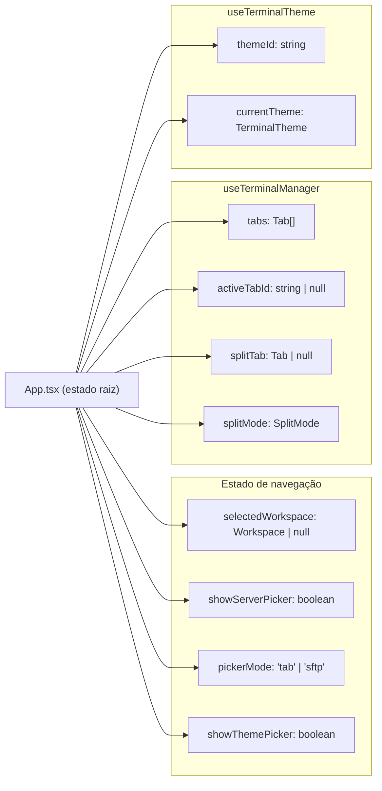

# Estado Global e Hooks

> O projeto não usa Context API global nem biblioteca de store (Zustand/Redux).
> O estado é gerenciado por hooks locais no `App.tsx` e descido via props.
> Hooks em `src/hooks/` encapsulam lógica reutilizável de I/O e UI.

---

## Estado raiz — `App.tsx`

O componente `App` mantém todo o estado de navegação e sessão de terminal.



| Estado | Tipo | Valor inicial | Quem atualiza |
|---|---|---|---|
| `selectedWorkspace` | `Workspace \| null` | `null` | `Sidebar.onSelectWorkspace` |
| `showServerPicker` | `boolean` | `false` | Toolbar de abas |
| `pickerMode` | `"tab" \| "sftp"` | `"tab"` | Toolbar de abas |
| `showThemePicker` | `boolean` | `false` | Botão de tema |

---

## Hook: `useTerminalManager`

**Arquivo:** `src/hooks/useTerminalManager.ts`
**Descrição:** Gerencia o ciclo de vida completo de abas de terminal — SSH, SFTP e PTY local.

### Estado interno

| Estado | Tipo | Valor inicial | Descrição |
|---|---|---|---|
| `tabs` | `Tab[]` | `[]` | Todas as abas abertas |
| `activeTabId` | `string \| null` | `null` | ID da aba com foco |
| `splitTabId` | `string \| null` | `null` | ID da aba no painel split |
| `splitMode` | `SplitMode` | `"none"` | `"none"` / `"horizontal"` / `"vertical"` |

### Ações

| Ação | Assinatura | Descrição |
|---|---|---|
| `openTab` | `(server: Server) => string` | Abre nova aba SSH |
| `openSftpTab` | `(server: Server) => string` | Abre nova aba SFTP dual-pane |
| `openLocalTab` | `() => string` | Abre nova aba PTY local |
| `closeTab` | `(tabId: string) => void` | Fecha aba, seleciona próxima disponível |
| `splitPane` | `(direction, server) => void` | Split com SSH |
| `splitLocalPane` | `(direction) => void` | Split com terminal local |
| `closeSplit` | `() => void` | Fecha painel split |
| `closeAll` | `() => void` | Fecha todas as abas |
| `updateSshSessionId` | `(tabId, sshSessionId) => void` | Registra session_id após connect |
| `setActiveTabId` | `(id: string) => void` | Muda aba ativa |

### Valores derivados

| Valor | Tipo | Descrição |
|---|---|---|
| `activeTab` | `Tab \| null` | `tabs.find(t => t.id === activeTabId)` |
| `splitTab` | `Tab \| null` | `tabs.find(t => t.id === splitTabId)` |
| `hasTabs` | `boolean` | `tabs.length > 0` |

### Tipo `Tab`

```typescript
interface Tab {
  id: string;
  server: Server | null;           // null para abas locais
  type: "terminal" | "sftp" | "local";
  sshSessionId: string | null;     // UUID retornado pelo backend após connect
}
```

---

## Hook: `useTerminalTheme`

**Arquivo:** `src/hooks/useTerminalTheme.ts`
**Descrição:** Gerencia o tema visual do terminal com persistência em `localStorage`.

### Estado

| Estado | Tipo | Valor inicial | Descrição |
|---|---|---|---|
| `themeId` | `string` | `'dark-default'` | ID do tema ativo (persiste em localStorage) |

### Ações

| Ação | Assinatura | Descrição |
|---|---|---|
| `changeTheme` | `(id: string) => void` | Muda e persiste o tema |

### Valores derivados

| Valor | Tipo | Descrição |
|---|---|---|
| `currentTheme` | `TerminalTheme` | Objeto completo do tema ativo |
| `themes` | `TerminalTheme[]` | Lista de todos os temas disponíveis |

### Temas disponíveis

| ID | Nome | Fundo |
|---|---|---|
| `dark-default` | Dark Default | `#000000` |
| `dracula` | Dracula | `#282a36` |
| `nord` | Nord | `#2e3440` |
| `solarized-dark` | Solarized Dark | `#002b36` |
| `one-dark` | One Dark | `#282c34` |
| `high-contrast` | High Contrast | `#000000` |

---

## Hook: `useToast`

**Arquivo:** `src/hooks/useToast.tsx`
**Descrição:** Sistema de notificações toast com fila e auto-dismiss.

### API pública

```typescript
const { success, error, info } = useToast();

success("Workspace sincronizado com sucesso!");
error("Falha ao conectar: connection refused");
info("Sincronização em andamento...");
```

### Tipo `Toast`

```typescript
interface Toast {
  id: string;
  type: "success" | "error" | "info";
  message: string;
}
```

> Toasts são auto-removidos após ~4 segundos. O `ToastProvider` deve envolver toda a árvore no `App.tsx`.

---

## Hook: `useAuth`

**Arquivo:** `src/hooks/useAuth.ts`
**Descrição:** Gerencia o estado de autenticação GitHub e expõe ações de login/logout.

### Ações

| Ação | Assinatura | Descrição |
|---|---|---|
| `login` | `() => Promise<GitHubUser>` | Inicia fluxo OAuth, retorna usuário |
| `logout` | `() => Promise<void>` | Remove token e limpa estado |
| `refreshUser` | `() => Promise<void>` | Recarrega dados do usuário |

### Estado interno

| Estado | Tipo | Descrição |
|---|---|---|
| `user` | `GitHubUser \| null` | Usuário autenticado atual |
| `loading` | `boolean` | Operação em andamento |

### Dependências

| Dependência | Motivo |
|---|---|
| `src/lib/api/auth.ts` | `github_login`, `get_current_user`, `github_logout` |

---

## Hook: `useSftpQueue`

**Arquivo:** `src/hooks/useSftpQueue.ts`
**Descrição:** Gerencia fila de transferências SFTP com progresso em tempo real via eventos Tauri.

### Estado

| Estado | Tipo | Descrição |
|---|---|---|
| `queue` | `TransferItem[]` | Transferências ativas e completas |

### Tipo `TransferItem`

```typescript
interface TransferItem {
  id: string;
  fileName: string;
  direction: "upload" | "download";
  status: "pending" | "in_progress" | "done" | "error";
  bytesTransferred: number;
  totalBytes: number;
}
```

### Eventos Tauri escutados

| Evento | Ação |
|---|---|
| `sftp://progress` | Atualiza `bytesTransferred` e `status` do item |

---

## Wrappers de API (`src/lib/api/`)

Funções finas ao redor de `invoke<T>()`, agrupadas por domínio:

| Arquivo | Comandos encapsulados |
|---|---|
| `workspaces.ts` | `getWorkspaces`, `createWorkspace`, `updateWorkspace`, `deleteWorkspace`, `pushWorkspace`, `pullWorkspace` |
| `servers.ts` | `getServers`, `createServer`, `updateServer`, `deleteServer` |
| `ssh.ts` | `sshConnect`, `sshWrite`, `sshResize`, `sshDisconnect` |
| `sftp.ts` | Todos os 17 comandos `sftp_*` |
| `pty.ts` | `ptySpawn`, `ptyWrite`, `ptyResize`, `ptyKill` |
| `vault.ts` | `isVaultConfigured`, `isVaultLocked`, `setupVault`, `unlockVault`, `checkSyncedVault`, `importSyncedVault`, `getVaultLastAccess` |
| `auth.ts` | `githubLogin`, `getCurrentUser`, `githubLogout` |

### Convenção de uso

```typescript
// Todo invoke é tipado explicitamente
const servers = await invoke<Server[]>("get_servers", { workspaceId });

// Sempre envolto em try/catch com toast de erro
try {
  await createServer({ ... });
  success("Servidor criado!");
} catch (e) {
  error(`Erro: ${e}`);
}

// Fire-and-forget (ex: input de terminal)
sshWrite(sessionId, data).catch(() => {});
```

---

## Atalhos de Teclado Globais

Registrados via `useEffect` no `App.tsx` — capturam eventos `keydown` em `window` (ignoram `<input>` e `<textarea>`):

| Constante | Binding | Descrição |
|---|---|---|
| `CLOSE_TAB` | `Ctrl+W` | Fecha aba ativa |
| `NEXT_TAB` | `Ctrl+Tab` | Próxima aba |
| `PREV_TAB` | `Ctrl+Shift+Tab` | Aba anterior |
| `SPLIT_H` | `Ctrl+\` | Split horizontal |
| `SPLIT_V` | `Ctrl+Shift+\` | Split vertical |
| `TOGGLE_SFTP` | `Ctrl+B` | Toggle painel SFTP |

**Função helper:**

```typescript
function matchesBinding(e: KeyboardEvent, binding: KeyBinding): boolean {
  return (
    e.key === binding.key &&
    e.ctrlKey === (binding.ctrl ?? false) &&
    e.shiftKey === (binding.shift ?? false) &&
    e.altKey === (binding.alt ?? false)
  );
}
```
